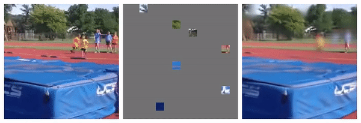
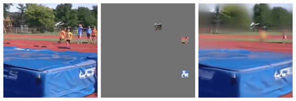
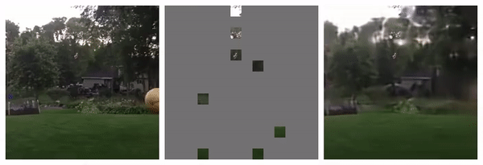
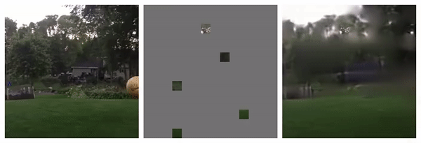

## Masked Autoencoders As Spatiotemporal Learners: A PyTorch Implementation

<p align="center">
  
</p>


This is a PyTorch/GPU re-implementation of the paper [Masked Autoencoders As Spatiotemporal Learners](https://arxiv.org/abs/2205.09113):
```
@Article{MaskedAutoencodersSpatiotemporal2022,
  author  = {Christoph Feichtenhofer and Haoqi Fan and Yanghao Li and Kaiming He},
  journal = {arXiv:2205.09113},
  title   = {Masked Autoencoders As Spatiotemporal Learners},
  year    = {2022},
}
```
Another implementation that supports AVA and SSv2 downstream evaluation is available in [PySlowFast](https://github.com/facebookresearch/SlowFast).

* This repo is a modification on the [MAE repo](https://github.com/facebookresearch/mae). Installation and preparation follow [INSTALL.md](https://github.com/facebookresearch/SlowFast/blob/main/INSTALL.md).

* This repo is based on [`timm==0.3.2`](https://github.com/rwightman/pytorch-image-models), for which a [fix](https://github.com/rwightman/pytorch-image-models/issues/420#issuecomment-776459842) is needed to work with PyTorch 1.8.1+.


### Catalog

- [x] Visualization demo
- [x] Pre-trained checkpoints + fine-tuning code + testing code
- [x] Pre-training code

### Visualization demo


Visualization of MAE output with 95% (left) and 98% (right) mask rate on the same video.
<div align="center">
   
</div>
<div align="center">
   
</div>
<div align="center">
   
</div>
<div align="center">
   
</div>
<div align="center">
   
</div>

Run our interactive visualization demo using [Colab notebook](TO_BE_ADD) (no GPU needed):
<p align="center">
  
</p>

### Fine-tuning with pre-trained checkpoints

The following table provides the pre-trained checkpoints used in the paper, pretrained with **90%** mask ratio and **1600 effective epochs**, converted from the PySlowFast codebase:
<table><tbody>
<!-- START TABLE -->
<!-- TABLE HEADER -->
<th valign="bottom"></th>
<th valign="bottom">ViT-Large</th>
<th valign="bottom">ViT-Huge</th>

<!-- TABLE BODY -->
<tr><td align="left">pre-trained checkpoint on Kinetics-400</td>
<td align="center"><a href="https://dl.fbaipublicfiles.com/video-mae/pretrain/mae_pretrain_vit_large_k400.pth">download</a></td>
<td align="center"><a href="https://dl.fbaipublicfiles.com/video-mae/pretrain/mae_pretrain_vit_huge_k400.pth">download</a></td>
</tr>
<tr><td align="left">md5</td>

<td align="center"><tt>edf3a5</tt></td>
<td align="center"><tt>3d7f64</tt></td>
</tr>
</tbody></table>

<table><tbody>
<!-- START TABLE -->
<!-- TABLE HEADER -->
<th valign="bottom"></th>
<th valign="bottom">ViT-Large</th>
<th valign="bottom">ViT-Huge</th>


<tr><td align="left">pre-trained checkpoint on Kinetics-600</td>
<td align="center"><a href="https://dl.fbaipublicfiles.com/video-mae/pretrain/mae_pretrain_vit_large_k600.pth">download</a></td>
<td align="center"><a href="https://dl.fbaipublicfiles.com/video-mae/pretrain/mae_pretrain_vit_huge_k600.pth">download</a></td>
</tr>
<tr><td align="left">md5</td>

<td align="center"><tt>9a9645</tt></td>
<td align="center"><tt>27495e</tt></td>
</tr>
</tbody></table>

<table><tbody>
<!-- START TABLE -->
<!-- TABLE HEADER -->
<th valign="bottom"></th>
<th valign="bottom">ViT-Large</th>
<th valign="bottom">ViT-Huge</th>


<tr><td align="left">pre-trained checkpoint on Kinetics-700</td>
<td align="center"><a href="https://dl.fbaipublicfiles.com/video-mae/pretrain/mae_pretrain_vit_large_k700.pth">download</a></td>
<td align="center"><a href="https://dl.fbaipublicfiles.com/video-mae/pretrain/mae_pretrain_vit_huge_k700.pth">download</a></td>
</tr>
<tr><td align="left">md5</td>

<td align="center"><tt>cdbada</tt></td>
<td align="center"><tt>4c4e3c</tt></td>
</tr>
</tbody></table>


The fine-tuning instruction is in [FINETUNE.md](FINETUNE.md).


### Pre-training

The pre-training instruction is in [PRETRAIN.md](PRETRAIN.md).

### License

This project is under the CC-BY-NC 4.0 license. See [LICENSE](LICENSE) for details.
